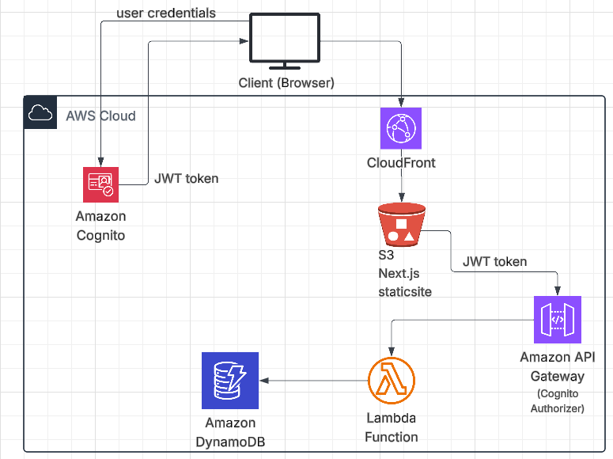

# secondScreen

Turn any phone into a wireless second display for your desktop — no cables, just a room code.

> **Live demo video** 👇  
> <!-- Replace the line below with your actual video embed or GIF -->
>[](https://youtu.be/damvIBe9CPk)
> <!-- OR if uploading to GitHub: paste your screen recording link here -->

---

## How it works

secondScreen uses **WebRTC** for peer-to-peer screen streaming between a desktop browser and a mobile device. Supabase acts as the signalling layer — coordinating the WebRTC handshake and handling auth — without any custom backend server.

1. Open the desktop app and start a session → get a **room code**
2. Enter the room code on your phone
3. Your phone instantly mirrors your desktop screen in real time

<!-- Replace with your architecture diagram image -->


---

## Architecture

```
Desktop (Host)                        Mobile (Viewer)
─────────────────                     ─────────────────
secondscreendesktop                   secondscreenmobile
  │                                         │
  │  1. Create session + generate offer     │
  │ ──────────────────────────────────────► │
  │           Supabase (Signalling)         │
  │  2. Mobile sends answer + ICE candidates│
  │ ◄────────────────────────────────────── │
  │                                         │
  └──────── WebRTC P2P Stream ─────────────┘
              (direct, low latency)
```

**Supabase handles:**
- Auth (email/password via `handle_new_user` trigger → `public.users`)
- Signalling — `sessions` table stores WebRTC `offer` / `answer` as JSONB
- ICE candidate exchange via the `candidates` table

Once the peer connection is established, all media streams flow **directly between devices** — Supabase is no longer in the loop.

---

## Tech stack

| Layer | Technology |
|---|---|
| Desktop app | Next.js + TypeScript |
| Mobile app | React Native + Expo |
| Auth & Database | Supabase (PostgreSQL) |
| Signalling | Supabase Realtime |
| Streaming | WebRTC (RTCPeerConnection) |

---

## Project structure

```
secondScreen/
├── secondscreendesktop/   # Next.js host app (desktop sender)
├── secondscreenmobile/    # React Native viewer app (mobile receiver)
└── schema.sql             # Supabase DB schema (users, sessions, candidates)
```

---

## Getting started

### Prerequisites

- Node.js 18+
- Expo CLI (`npm install -g expo-cli`)
- A [Supabase](https://supabase.com) project

### 1. Set up the database

Run `schema.sql` in your Supabase project's SQL editor. This creates:
- `public.users` — synced from Supabase Auth via trigger
- `public.sessions` — stores WebRTC offer/answer per session
- `public.candidates` — stores ICE candidates for peer negotiation

### 2. Desktop app

```bash
cd secondscreendesktop
cp .env.example .env.local
# Add your NEXT_PUBLIC_SUPABASE_URL and NEXT_PUBLIC_SUPABASE_ANON_KEY
npm install
npm run dev
```

### 3. Mobile app

```bash
cd secondscreenmobile
cp .env.example .env
# Add your Supabase credentials
npm install
npx expo start
```

---

## How the WebRTC signalling works

Standard WebRTC requires a signalling channel to exchange connection metadata before the peer stream begins. Here's what happens under the hood:

1. **Host creates an offer** (`RTCSessionDescription`) and saves it to `sessions.offer` in Supabase
2. **Viewer reads the offer**, generates an **answer**, and saves it to `sessions.answer`
3. Both sides exchange **ICE candidates** through the `candidates` table (Supabase Realtime subscription)
4. Once ICE negotiation completes, the **P2P stream opens** — direct device-to-device, no relay

---

## Roadmap

- [ ] TURN server fallback for restricted networks
- [ ] Multi-viewer support (one host, many viewers)
- [ ] Touch input relay from mobile back to desktop
- [ ] Resolution / quality controls

---

## Author

**Dheeraj Kumar Ravi Gowda**  
[Portfolio](https://dheerajgowda.dev) · [LinkedIn](https://linkedin.com/in/dheerajgowda) · [GitHub](https://github.com/Dheeraj164)
